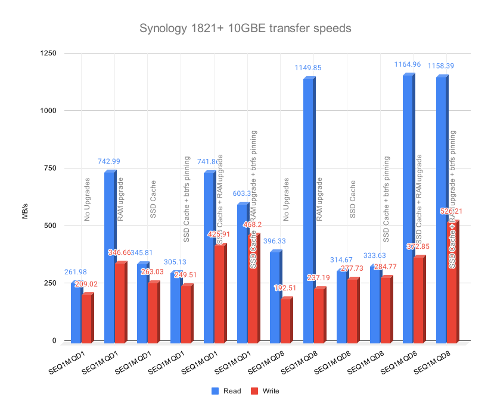
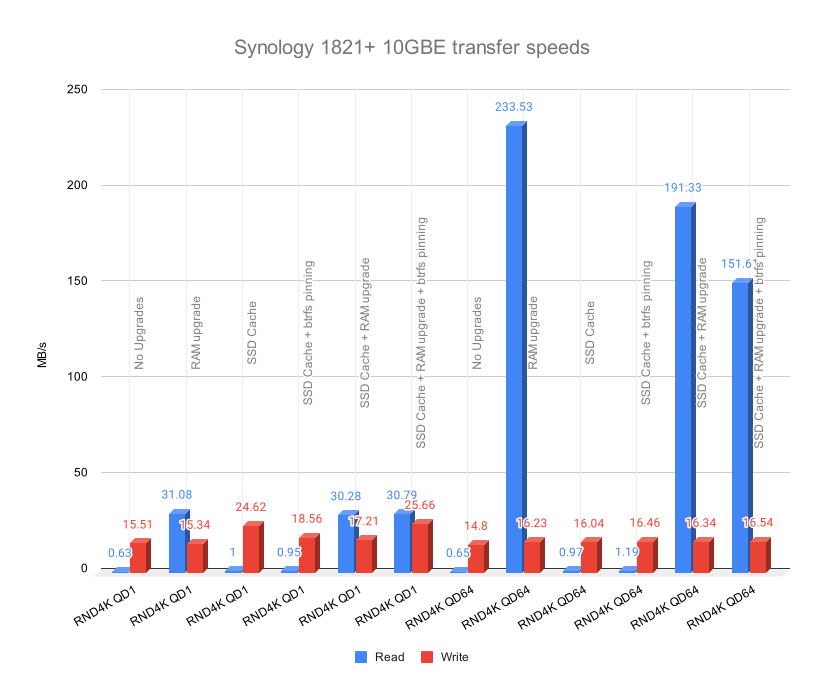

# How to go about upgrading the NAS

I have been using Synology 1821+ as my NAS and have been pretty happy with it. The first upgrade I did in my homelab was to set up 10 gig networking. My primary need to do so (other the insatiable desire to always upgrade) was to speed up the transfer for my photos and videos that I manage on this NAS. DSLR/GoPro/iPhone photos and videos take in full resolution and high frame rates can be surprisingly large.

It was serving me well but I did notice a bit of lag when performing multiple operations or trying to access SMB share and browsing files. This sent me on the path for upgrades.

The possible ways to upgrade and maximize the network speeds available to me were:

-   Upgrade the NAS to a full flash storage (💰💰💰💰💰)
-   Upgrade the RAM (💰💰)
-   Add an SSD cache (💰)

Despite the desire to have the latest and greatest, upgrading to an all flash NAS obviously did not make sense. Hence, the other two options. But what use is an upgrade if you can't measure the performance improvements. So here is a somewhat definitive guide on what to expect with RAM and SSD cache upgrades.

# My Setup

I am connecting to my NAS over 10GbE using my Macbook Pro 14-inch. Here is my NAS configuration:

-   Synology 1821+ (AMD Ryzen V1500B)
-   4 GB RAM
-   DSM 7.2-64570 Update 3
-   4 x 16TB 7200 rpm HDD with SHR 2
-   Mellanox MCX311A-XCAT ConnectX-3 EN 10G Ethernet 10GbE SFP+ PCI-E NIC

Benchmark software: [AmorphousDiskMark](https://www.katsurashareware.com/amorphousdiskmark/)

Proposed Upgrade:

-   Add 1 x [16GB DDR4-2666 PC4-21300 ECC SODIMM Compatible with Synology D4ECSO-2666-16G Memory Upgrade Module by NEMIX RAM](https://www.amazon.com/dp/B09G4H2M3F?ref=ppx_yo2ov_dt_b_product_details&th=1)
-   Add 2 x SAMSUNG 970 EVO Plus SSD 500GB NVMe in RAID 1

# Results

I think I am content with the results I got. However, for anyone looking for guidance, here are my key takeaways:

-   If your use case is read heavy, upgrading just the RAM is a huge step in the right direction. You can ignore the SSD cache if you are not bothered by a slightly slower write. Bear in mind, a read-write cache has it's own risks and if you are going to use it as read cache alone, the performance gains may not be as high when adding an SSD cache on top of RAM upgrade.
-   If you

    -   will be writing multiple small files
    -   and have a power backup added to your homelab
    -   and are aware of the risks of a read-write cache

    then the gains in write speeds may be worth it to add an SSD cache. Do enable the btrfs metadata pinning if you do so and ensure you have large enough SSDs to hold the metadata (~2% of your NAS volume).

Here are the detailed results from the benchmarks:

### Sequential read/write results

### Random read/write results

So my recommendation is to definitely go with a RAM upgrade and if you feel like it, add SSD cache as well.

## Additional considerations

There are few aspects that I have not covered in this test and may impact the results:

-   The benchmarks executed most likely operates on cold cache and hence the read performance on a warm cache might be better than demonstrated here. However, given the massive increase in read speeds with only RAM upgrade makes me side with RAM upgrade to improve read performance.
-   Certain workloads (eg. backup tasks) may benefit with read only SSD cache with btrfs metadata pinning. However, since most of these processes are background processes in most cases, I would not consider it for user perceived latencies.
